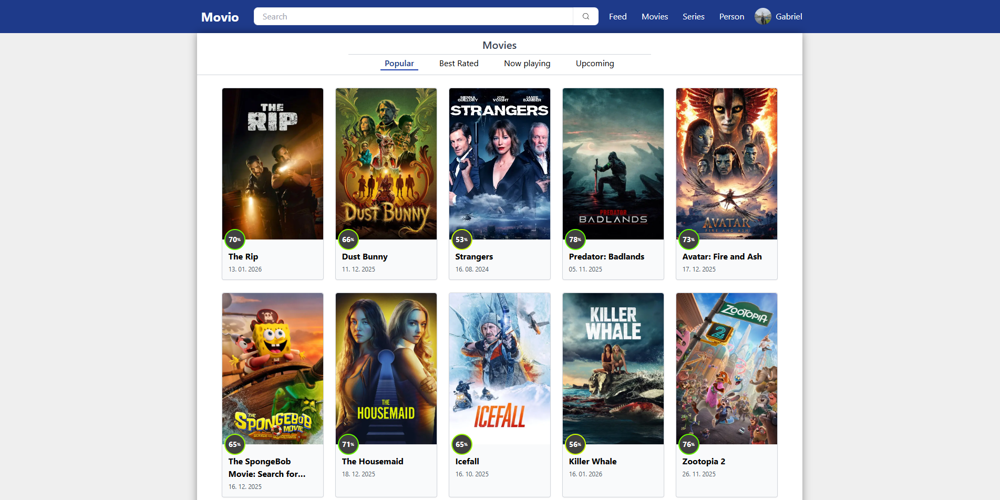
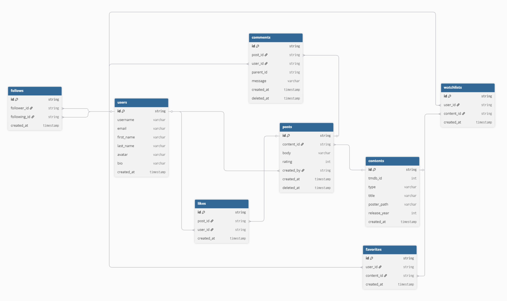

# 🎬 Movio

A full-stack social platform for movie and TV series enthusiasts. Discover trending content, connect with other film lovers, and share your thoughts through a personalized feed.

## [Live Demo →](https://movio-delta.vercel.app/)

> **Quick Test Account:** If you don’t want to create your own account, you can log in directly using:
>
> - **Username:** `ivandemo`
> - **Password:** `Ivandemo1-`



## Key Features

### User System

- Secure JWT authentication with encrypted passwords
- Customizable user profiles
- Follow/unfollow other movie enthusiasts
- View profiles and activity of other users

### Content Discovery

- **Browse by Category**: Popular, Top Rated, Now Playing, Upcoming
- **Advanced Search**: Discover movies, TV series, and people (actors/directors)
- **Detailed Pages**: Full information including cast, crew, ratings, and trailers
- **TMDB Integration**: Real-time data from The Movie Database

### Social Features

- **Personalized Feed**: See posts only from users you follow
- **Create Posts**: Share your thoughts about movies and series
- **Spoiler Alerts**: Mark posts as spoilers to protect others
- **Like & Comment**: Engage with posts from the community
- **Activity Tracking**: View your post history and interactions

### Personal Collections

- **Watchlist**: Save movies and series you want to watch
- **Favorites**: Keep track of your all-time favorites
- **Easy Management**: Add/remove items with one click

### User Experience

- Fully responsive design (mobile, tablet, desktop)
- Fast page loads with Next.js Server-Side Rendering
- Smooth animations and transitions
- Intuitive navigation

## Built With

- **Frontend**: Next.js 14, TypeScript, Tailwind CSS
- **Backend**: Node.js, MongoDB, Mongoose
- **Auth**: JWT, bcrypt
- **API**: The Movie Database (TMDB)
- **Deployment**: Vercel

## Technical Highlights

- Server Actions for secure data mutations
- Dynamic rendering with `force-dynamic` for real-time content
- Optimized MongoDB queries with `.lean()` for performance
- HTTP-only cookies for secure session management
- Responsive design with mobile-first approach

## Database Schema



The diagram illustrates core entities such as users, posts, comments, follows, watchlists, and their relationships within the application.

## Local Development

```bash
# Clone the repo
git clone https://github.com/gabrieljanjic/movio.git

# Install dependencies
npm install

# Run development server
npm run dev
```

_For environment variables and local setup, feel free to reach out._

## Contact

- **LinkedIn**: [Gabriel Janjić](https://www.linkedin.com/in/gabriel-janjic/)
- **Email**: janjicgabriel1@gmail.com
- **Live Demo**: [movio-delta.vercel.app](https://movio-delta.vercel.app)
